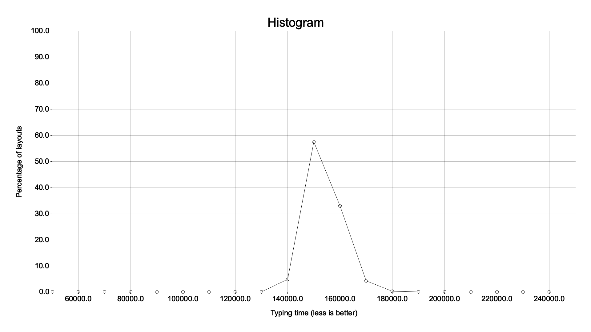
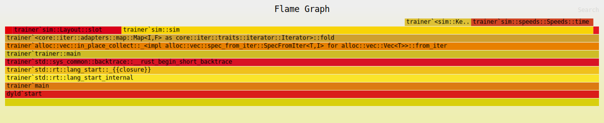

# Design process

## Brainstorming

#### 2023/10/18
Problem statement: Qwerty is a very unoptimized keyboard layout. By creating a better layout for myself and putting it onto a real keyboard, I could become a much faster typist. I plan to do a number of different tests before running simulating the speed of keyboard layouts, including testing speeds of different keypresses for different people to create a genereal picture of how fast the different keys are pressed.

#### 2023/10/20
I am current working on a method to test how fast different fingers are. My plan is to use the information I have about where different fingers belong on the keyboard and test how fast they can move between those keys. I will use this information later to create a realistic simulation of how fast a keyboard layout is for typing a specific text. Here is an example of what a test would look like.


I will continue to work on this test until I have some strong data to help me create the ultimate keyboard layout.

#### 2023/10/24
After finishing the test, I realize that I approached it the wrong way. The test currently works by having the player hover their finger over the start key and then moving it to the end key when it turns purple. However, this is 
1. Boring as hell
2. Judges reaction time instead of finger speed.

In the coming weeks, I will rewrite the test to have the results better represent the finger speed of the user.

#### 2023/10/30
I have begun working on the new test. I am happy that I am rewriting it, from my experience last time I am able to make it much more organized and less complex. The new test even begins with some instructions to help the user begin.


#### 2023/11/1
I FINISHED THE TEST :D. It works very well, and I have already used it on four people, which means that I have 200 samples. However, there are (3*2*6) + (6*5*2) = *96* possible movements that I am trying to measure, so it is imperative that I get much more data. I estimate that I will be able to get maybe 15 more people to do the test, which means I will have around 1000. I may end up just running a lot of tests on myself, as it will be a lot more efficient and I consider myself a pretty normal typer (unlike a lot of my accomplices) In terms of analysis, I will probably try to eliminate as many outliers as I can to normalize the data. 

#### 2023/11/7
After finishing my testing, I have written my data analysis. This involved
- Removing the outliers from the data
- Taking averages for each finger
- Taking averaages for each row
The results of my analysis are in `analysis/output.json`. Now that I have finished my research, I am ready to begin the ideating stage.

## Ideating

#### 2023/11/7
I need to find a keyboard layout that is much better than the Qwerty layout. My plan is to iterate through a lot of different layouts and find which one is the best. I have made a list of things I need to do in order for this to work.
1. Compile a large set of texts to test the keyboard layout on.
   1. English
   2. French
   3. German
   4. ... (more)
2. Create a simulation that tests how fast a keyboard layout can type this dataset.
3. Run this simulation on millions of keyboard layouts and find the fastest one.
This ideating phase was pretty easy for me since I have already thought about how I want this project to work. Thus, this will be the only entry in this section

## Prototyping

#### 2023/11/10
After a little bit of experimenting and scripting, I have finally collected a 3.2 million characters to be used as the speed test. My collection is a compilation of the top 100 wikipedia articles. I copied the list onto my computer, deconstructed it into a list of urls and then downloaded each on onto my computer for filtering. The `text.txt` file is now ready to be used in a simulation. This means that step 1 of my plan is now complete.
- [x] Compile a large set of texts to test the keyboard layout on.

#### 2023/11/12
I moved back to Rust for this one. I am going to need to run this a lot of times, so many times that to be frank, it would be environmentally irresponsible to write it in Python. My simulation works exactly as planned, it keeps a state for each finger as it moves along the provided text and estimates how long it would take to type it. Here is an example output comparing Qwerty to Dvorak
```
time of qwerty: 103495.30881369725 seconds
time of dvorak: 85596.81932878871 seconds
```
- [x] Create a simulation that tests how fast a keyboard layout can type this dataset.

#### 2023/11/16
Bam. Project is pretty much done. That was a joke. I did make a pretty fast keyboard layout though. On the plane ride to Toronto I wrote some code to plot how fast a bunch of keyboard layouts were. Here is the graph:

As you can see, most keyboards were around 150,000 in score (lower is better). After getting this baseline, I wrote a script that creates some starter keyboards and then continues to improve them. I ended up with a score around 138,000. Pretty good. I'm going to keep working at this, my goal is to find a keyboard layout that gets a score of 130,000 or less, but I can't be sure one even exists. We'll see what happens.

#### 2023/11/17
Now that the first cycle of prototyping is done, I want to work on refining my methods and working towards this goal:
1. Create a keyboard layout that gets a score of less than 135,000.
How will I do this? Glad you asked, faceless companion. I have a few ways of getting closer to this goal that attack the problem from various angles.
2. Profile my code. Right now, it is EXTREMELY SLOW. I NEED BLAZINGLY FAST CODE. Unfortunatly, I don't know exactly why. So, I am going to benchmark it and find out why it's so slow.
3. Optimize the simulator that scores layouts. I already have a testing suite that ensures my simulator behaves correctly, but I want to expand it and then work on optimizing it. I already know this is a big bottleneck for my layout generation, but my profiling should help me understand how much time I should spend on this.
4. Improve my methods. Right now, my test is very linear and quite frankly, dumb. Not dumb as in I designed it badly, dumb as in  unsophisticated. I will do some more research and then rewrite my generator/trainer to hopefully become more efficient.

#### 2023/11/17
I used the `flamegraph` utitlity to generate this fantastic visualization of my program:

It shows that I need to work on 3 things:
- I store my keyboard as a list of keys, which means that when I want to find where a key is, I have to search the whole thing. By storing the keys from a-z + chars, I will be able to go from O(n) to O(1) and eliminate this problem
- When reading my text sample, my program spends a substantial amount of time translating `char`s into my `Key` enum. This is easily fixable by pre-processing my text file. This will again reduce the task from O(n) to O(1)
- For some reason, my program is very slow at getting the travel time between one key and another. This should be easily fixed by storing a matrix of travel times so I don't repeat calculations. O(n) to O(1) seems like a very common theme here, I like it :D.

- [x] Profile my code

#### 2023/11/18
Today is optimizing day! Here are the results of my optimization.
The average time `sim` takes to run is currently `67.4ms`
1. Refactor before optimization: `-12%` time -> `59.4ms`!
2. Reformat layout storage: `-14%` time -> `51.1ms`!
3. Preprocess text input: `-13%` time -> `44.3ms`!
4. HOLY COW! Precalculating the speeds: `-55%` time -> `20.0ms`!!!!!
Great success! Truly inspiring work by yours truly. Thanks to `flamegraph-rs` and `criterion`, I was able to make my simulation run a WHOPPING `108%` FASTER.

- [x] Optimize my code

#### 2023/11/21
Now that my simulation is :fire: *BLAZINGLY FAST* :fire:, it's time to put it to work :flex: :flex: :flex:. Now that I've reached my emoji quota put into place by my completely sane and very normal deskmate, lets talk about simulated annealing. I need to find the optimal keyboard layout, and it turns out that finding it will work a lot like finding the minimum value in a line, except instead of having 1 dimension, it has 30. I can't realisticially check the 265252859812191058636308480000000 keyboard layouts to find the fastest one, this would take 33644452030972990694610 years or just under 2.5 trillion times the age of our universe by using the combined computing power of my PC and my laptop. INSTEAD, I will find the keyboard layout that is hopefully very close to the fastest keyboard layout using **SIMULATED ANNEALING** (for dramatic effect imagine this being yelled in a parking lot with very strong echo). I will explain what this is after I finish reading the wikipedia article about it, but I'm pretty confident that it's what I'm looking for.

#### 2023/11/23
I finished setting up annealing and I found a very fast keyboard: 

k x , / ; v g j b z 
 t l i a o c p y n s
  m r u q . w f e h d

This was pretty easily achieved by using the `metaheuristics` crate for my `sim` function. 
However, before I wrap up the project, I'm going to do some final modifactions. 
1. I'm going to lock some keys in place from querty. Specifically, I'm going to keep the common command keys `a, s, z, x, c, v` in their original positions, as well as `;, ,, ., /` to keep the keyboard looking clean.
2. I'm going to slightly rework my `sim` function to be a better representation of how successful I've been and give my annealer more reward for succeeding. Currently, it takes just as long for my simulation to click the same key twice as it does to move a finger from one location to the other.
3. I'm going to set up my metaheuristics to run for a long time. It only uses one core, which means that its a bit slower but it also means that I can easily multithread it or just run it in the background on my PC. I'll probably end up running 4 at once for a few days and find one last keyboard layout before I wrap the project up.

#### 2023/11/24
I finished the first two of my final goals. Locking the keys in place was surprisingly easy, I just stored the variable 20 keys seperately and shuffled them alone. Reworking my sim function was also easy. Querty now has an efficiency loss of `96980.6` while a keyboard that took a minute to optimize has an efficiency loss of `77024.5`. Tonight, I will begin running my final simulation :D. If all goes well my final entry will be tomorrow.

## Making

#### 2023/11/25
I have started the program, it will run for the next 24 hours and find me the ultimate keyboard layout! See you on the other side...

## Showing

#### 2023/11/26
BEHOLD: 
o d g m f n h u l e 
 a s t b p y k i r ; 
  z x c v w q j , . /
The eloquent keyboard layout in all of its glory.
My layout is 26% more efficient than qwerty. Here is a photo of it in real life:
[images/final.jpg](Final layout)
I'm pretty happy with how this project went. I usually don't find projects that I can stay engaged in for more than a month, so this was a nice exception. If I could do it again, I don't think that there's anything I would change. 
As for my typing, I don't plan on switching to this layout. I already type at 130 WPM, thats fast enough for me :D
Onto the next project!